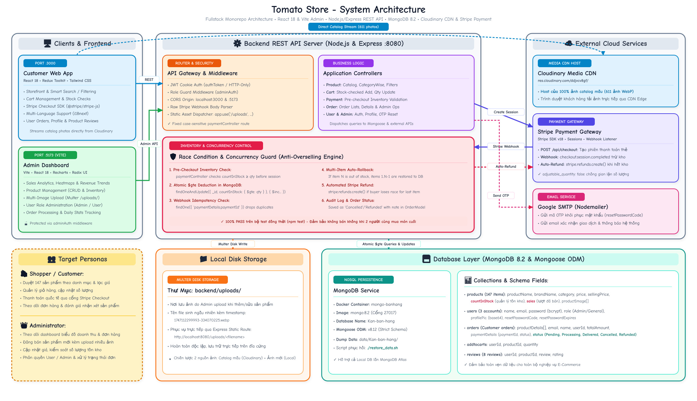

# 🍅 Tomato Store - Nền Tảng Thương Mại Điện Tử & Quản Trị(Fullstack E-Commerce)

Hệ thống thương mại điện tử hiện đại kiến trúc Fullstack Monorepo, tích hợp cổng thanh toán trực tuyến quốc tế Stripe, lưu trữ hình ảnh nội bộ server (Local Disk Storage via Multer), xác thực bảo mật JWT qua Cookie, đa ngôn ngữ (i18n) cùng bảng điều khiển phân tích số liệu quản trị (Admin Analytics Dashboard) chuyên sâu.

---

## 📐 Sơ Đồ Kiến Trúc Hệ Thống (System Architecture)

Sơ đồ phác thảo kiến trúc luồng dữ liệu và các thành phần chính trong hệ thống (lưu trữ hình ảnh 100% nội bộ trên server qua Multer):



### Luồng Hoạt Động Chính:
1. **Client Tier**: 
   - **Customer Web App (React 18)**: Dành cho người mua sắm duyệt sản phẩm, quản lý giỏ hàng và thanh toán.
   - **Admin Dashboard (Vite + React)**: Dành cho ban quản trị theo dõi chỉ số kinh doanh, upload quản lý sản phẩm, đơn hàng và phân quyền.
2. **Backend Tier (Node.js & Express REST API)**:
   - Xử lý xác thực người dùng bằng JSON Web Token (JWT) lưu trữ an toàn trong HTTP-only cookies.
   - Xử lý và lưu trữ file ảnh trực tiếp trên ổ đĩa server thông qua **Multer DiskStorage** (`/uploads/`).
   - Xử lý thanh toán thẻ quốc tế qua Stripe API và Stripe Webhooks tự động cập nhật trạng thái đơn hàng.
   - Gửi mã xác thực OTP khôi phục mật khẩu qua giao thức SMTP (Nodemailer).
3. **Data & Services**:
   - **MongoDB**: Cơ sở dữ liệu NoSQL lưu trữ Users, Products, Carts, Orders, Reviews.
   - **Local Server Storage (`/uploads/`)**: Lưu trữ và phân phối ảnh sản phẩm nội bộ máy chủ, không phụ thuộc dịch vụ bên thứ ba.
   - **Stripe**: Cổng thanh toán trực tuyến quốc tế.
   - **Google SMTP**: Dịch vụ email thông báo và mã kích hoạt OTP.

---

## 🛠️ Công Nghệ Sử Dụng (Tech Stack)

### 1. Backend API (`/backend`)
- **Runtime & Framework**: Node.js, Express.js (v4.21)
- **Database & ODM**: MongoDB, Mongoose (v8.12)
- **Xác thực & Bảo mật**: JSON Web Token (`jsonwebtoken`), `bcryptjs`, `cookie-parser`, `cors`
- **Lưu trữ hình ảnh**: `multer` Disk Storage (Lưu trữ ảnh nội bộ máy chủ trong `uploads/`)
- **Thanh toán**: Stripe SDK (`stripe` v18) + Webhook listener
- **Email Service**: `nodemailer`
- **Công cụ hỗ trợ**: `dotenv`, `moment`, `nodemon`

### 2. Giao Diện Người Dùng - Khách Hàng (`/frontend`)
- **Framework & Core**: React 18, React Router DOM (v6)
- **Quản lý State**: Redux Toolkit (`@reduxjs/toolkit`), React Redux
- **UI & Styling**: Tailwind CSS, Material UI (`@mui/material`), DaisyUI, Ant Design
- **Hiệu ứng & Trải nghiệm**: Framer Motion, GSAP, Swiper, PhotoSwipe, React Zoom Pan Pinch, AOS
- **Thanh toán Frontend**: Stripe React SDK (`@stripe/react-stripe-js`, `@stripe/stripe-js`)
- **Đa ngôn ngữ (i18n)**: `i18next`, `react-i18next` (Tiếng Việt & English)
- **Biểu mẫu & Thông báo**: Formik, Yup, React Toastify, SweetAlert2

### 3. Giao Diện Quản Trị - Admin Dashboard (`/frontend/admin`)
- **Build Tool & Framework**: Vite, React 18, React Router DOM (v7)
- **Biểu đồ & Báo cáo phân tích**: Recharts, Lucide React
- **UI Components**: Radix UI Primitives, Tailwind CSS, Ant Design
- **Hiệu ứng & Tương tác**: Framer Motion, SweetAlert2

---

## 🚀 Các Tính Năng Nổi Bật

### 🛒 Dành cho Khách Hàng (Customer)
- **Hệ thống tài khoản**: Đăng ký, đăng nhập, bảo mật mật khẩu bcrypt, khôi phục mật khẩu qua mã OTP gửi về Email, cập nhật hồ sơ cá nhân.
- **Duyệt & Tìm kiếm sản phẩm**:
  - Phân loại theo danh mục đa dạng (đồng hồ, tai nghe, điện thoại, máy ảnh, phụ kiện,...).
  - Bộ lọc sản phẩm linh hoạt kết hợp thanh tìm kiếm thông minh.
  - Xem chi tiết sản phẩm với trình chiếu ảnh phóng to, hiển thị đánh giá sao và bình luận của người mua trước.
- **Giỏ hàng & Đơn hàng**:
  - Thêm / sửa số lượng / xóa sản phẩm khỏi giỏ hàng đồng bộ trực tiếp với MongoDB.
  - Thanh toán trực tuyến an toàn qua Stripe Checkout.
  - Xem danh sách lịch sử đơn hàng và trạng thái vận chuyển.
- **Hỗ trợ đa ngôn ngữ**: Chuyển đổi ngôn ngữ Tiếng Việt / Tiếng Anh nhanh chóng.

### 📊 Dành cho Quản Trị Viên (Admin)
- **Báo cáo kinh doanh thông minh**:
  - Thống kê doanh thu tháng này, số lượng đơn hàng trong ngày.
  - Biểu đồ xu hướng bán hàng (Sales Trend Chart) & Cơ cấu doanh số theo danh mục (Category Distribution).
  - Tỷ lệ người dùng mới theo tháng, người dùng đang hoạt động (Active Users), Heatmap tần suất người dùng hoạt động.
- **Quản lý sản phẩm**: Đăng tải sản phẩm mới kèm upload nhiều ảnh lưu trực tiếp trên server, chỉnh sửa giá bán, giá niêm yết, phân loại và xóa sản phẩm.
- **Quản lý đơn hàng**: Theo dõi chi tiết từng đơn hàng, trạng thái thanh toán và xử lý đơn.
- **Quản lý người dùng**: Quản lý danh sách thành viên, cập nhật quyền hạn (User / Admin), hỗ trợ khóa hoặc xóa tài khoản.

---

## 📁 Cấu Trúc Thư Mục Dự Án (Repository Structure)

```plaintext
tomato_ban_hang/
├── README.md                           # Tài liệu giới thiệu chính trên GitHub
├── .gitignore                          # Cấu hình bỏ qua các file nhạy cảm và file nặng
├── docs/                               # Tài nguyên tài liệu & sơ đồ nét vẽ
│   └── architecture_diagram.jpg        # Sơ đồ kiến trúc hệ thống dạng nét vẽ phác thảo (Local Storage)
├── backend/                            # REST API Server (Node.js & Express)
│   ├── .env.example                    # File cấu hình môi trường mẫu cho backend
│   ├── .gitignore                  # Gitignore riêng cho backend
│   ├── index.js                    # Entry point chính của backend server
│   ├── config/                     # Kết nối DB (db.js) và Stripe (stripe.js)
│   ├── controllers/                # Logic nghiệp vụ (user, product, order, adminpanal)
│   ├── middleware/                 # Middleware xác thực (authToken, adminAuth, upload)
│   ├── models/                     # Mongoose Schema (User, Product, Cart, Order, Review)
│   ├── routers/                    # Định tuyến API endpoints (kèm upload ảnh nội bộ)
│   └── uploads/                    # Thư mục lưu trữ file ảnh upload cục bộ
├── frontend/                       # Client Storefront (React 18)
│   ├── .env.example                # File môi trường mẫu cho client
│   ├── .gitignore                  # Gitignore cho client
│   ├── package.json
│   ├── public/                     # Tài nguyên tĩnh, favicon, logos
│   └── src/
│       ├── components/             # UI Components (Header, Banner, ProductCard, Cart...)
│       ├── pages/                  # Các trang (Home, ProductDetails, Cart, Login...)
│       ├── stores/                 # Quản lý state tập trung Redux Toolkit
│       ├── helpers/                # Tiện ích bổ trợ (upload, currency, fetch API)
│       └── i18n/                   # Cấu hình đa ngôn ngữ (en/vi)
└── frontend/admin/                 # Quản trị viên Dashboard (React + Vite)
    ├── .env.example                # File môi trường mẫu cho admin
    ├── .gitignore                  # Gitignore cho admin
    ├── vite.config.js
    └── src/
        ├── components/             # Biểu đồ Recharts, Heatmaps, Bảng dữ liệu
        └── pages/                  # Trang phân tích (Overview, Products, Orders, Users)
```

---

## ⚙️ Hướng Dẫn Cài Đặt & Chạy Dự Án

### Yêu Cầu Môi Trường
- **Node.js**: Phiên bản 18.x hoặc 20.x trở lên
- **npm** hoặc **yarn**
- **MongoDB**: Cài đặt MongoDB Local hoặc có tài khoản MongoDB Atlas Cloud

---

### Bước 1: Clone Repository
```bash
git clone <URL_REPO_GITHUB_CUA_BAN>
cd tomato_ban_hang
```

---

### Bước 2: Cài Đặt & Chạy Backend

1. **Di chuyển vào thư mục backend**:
   ```bash
   cd backend
   npm install
   ```

2. **Thiết lập biến môi trường**:
   Sao chép file mẫu `.env.example` thành `.env`:
   ```bash
   cp .env.example .env
   ```
   *Mở file `.env` và cập nhật các thông tin của bạn:*
   - `MONGODB_URI`: Đường dẫn kết nối MongoDB (ví dụ: `mongodb://localhost:27017/Kan-ban-hang`).
   - `TOKEN_SECRET_KEY`: Khóa bí mật dùng để mã hóa JWT token.
   - `EMAIL_USER` & `EMAIL_PASS`: Email và mật khẩu ứng dụng Gmail để gửi OTP.
   - `STRIPE_SECRET_KEY` & `STRIPE_ENDPOINT_WEBHOOK_SECRET_KEY`: Khóa API bí mật của Stripe.

3. **Khởi chạy Backend**:
   ```bash
   npm run dev
   ```
   > Backend sẽ chạy tại: **http://localhost:8080**

---

### Bước 3: Cài Đặt & Chạy Khách Hàng Frontend (Storefront)

1. **Mở terminal mới, di chuyển vào thư mục frontend**:
   ```bash
   cd frontend
   npm install --legacy-peer-deps
   ```

2. **Thiết lập biến môi trường**:
   ```bash
   cp .env.example .env
   ```
   *Điền thông tin vào `.env`:*
   ```env
   REACT_APP_STRIPE_PUBLIC_KEY=pk_test_your_stripe_publishable_key
   REACT_APP_URL_BACKEND=http://localhost:8080
   ```

3. **Khởi chạy Frontend**:
   ```bash
   npm start
   ```
   > Ứng dụng mua hàng sẽ mở tại: **http://localhost:3000**

---

### Bước 4: Cài Đặt & Chạy Bảng Quản Trị (Admin Dashboard)

1. **Mở terminal mới, di chuyển vào thư mục admin**:
   ```bash
   cd frontend/admin
   npm install
   ```

2. **Thiết lập biến môi trường**:
   ```bash
   cp .env.example .env
   ```

3. **Khởi chạy Admin Dashboard**:
   ```bash
   npm run dev
   ```
   > Bảng quản trị sẽ mở tại: **http://localhost:5173**

---

## 🔌 Danh Sách Các Endpoint API Chính

| Nhóm chức năng | Phương thức | Endpoint | Mô tả | Quyền hạn |
| :--- | :---: | :--- | :--- | :--- |
| **Xác thực (Auth)** | `POST` | `/api/signup` | Đăng ký tài khoản người dùng mới | Public |
| | `POST` | `/api/signin` | Đăng nhập hệ thống (set JWT cookie) | Public |
| | `POST` | `/api/userLogout` | Đăng xuất người dùng | Public |
| | `POST` | `/api/forgot-password` | Gửi mã OTP khôi phục mật khẩu | Public |
| | `POST` | `/api/verifyResetCode` | Xác thực mã OTP | Public |
| | `POST` | `/api/reset-password` | Đặt lại mật khẩu mới | Public |
| | `GET` | `/api/userdetailes` | Lấy thông tin tài khoản hiện tại | User (Token) |
| **Sản phẩm & Upload** | `GET` | `/api/get-categoryProduct` | Lấy danh mục sản phẩm | Public |
| | `POST` | `/api/category-product` | Lấy danh sách sản phẩm theo danh mục | Public |
| | `GET` | `/api/product-details/:id` | Xem chi tiết 1 sản phẩm | Public |
| | `GET` | `/api/products/search` | Tìm kiếm sản phẩm theo từ khóa | Public |
| | `GET` | `/api/filter-product` | Lọc sản phẩm theo tiêu chí | Public |
| | `POST` | `/api/upload-image` | Upload 1 ảnh lên thư mục `/uploads/` nội bộ | Admin |
| | `POST` | `/api/upload-product` | Thêm sản phẩm mới (kèm nhiều ảnh Multer) | Admin |
| | `POST` | `/api/update-product` | Cập nhật thông tin sản phẩm | Admin |
| | `DELETE` | `/api/product-delete/:id` | Xóa sản phẩm khỏi hệ thống | Admin |
| **Đánh giá (Review)** | `POST` | `/api/review` | Gửi bình luận và đánh giá sản phẩm | User (Token) |
| | `GET` | `/api/review/:id` | Lấy danh sách đánh giá của sản phẩm | Public |
| **Giỏ hàng & Đơn** | `POST` | `/api/addtocart` | Thêm sản phẩm vào giỏ | User (Token) |
| | `GET` | `/api/view-cart-product` | Xem danh sách giỏ hàng | User (Token) |
| | `POST` | `/api/update-cart-product` | Thay đổi số lượng mua | User (Token) |
| | `DELETE` | `/api/delete-cart-product` | Xóa sản phẩm khỏi giỏ | User (Token) |
| | `POST` | `/api/checkout` | Khởi tạo phiên thanh toán Stripe | User (Token) |
| | `POST` | `/api/webhook` | Webhook Stripe đồng bộ trạng thái đơn | Stripe Server |
| | `GET` | `/api/oder-list` | Lấy lịch sử đơn hàng đã đặt | User (Token) |
| **Quản trị (Admin)** | `GET` | `/api/all-user` | Lấy toàn bộ danh sách thành viên | Admin |
| | `GET` | `/api/get-sales-overview` | Báo cáo doanh số bán hàng | Admin |
| | `GET` | `/api/get-sales-trend` | Biểu đồ xu hướng tăng trưởng doanh số | Admin |
| | `GET` | `/api/get-user-activity-heatmap` | Dữ liệu Heatmap mật độ hoạt động | Admin |
| | `GET` | `/api/get-orders` | Quản lý toàn bộ đơn đặt hàng | Admin |


